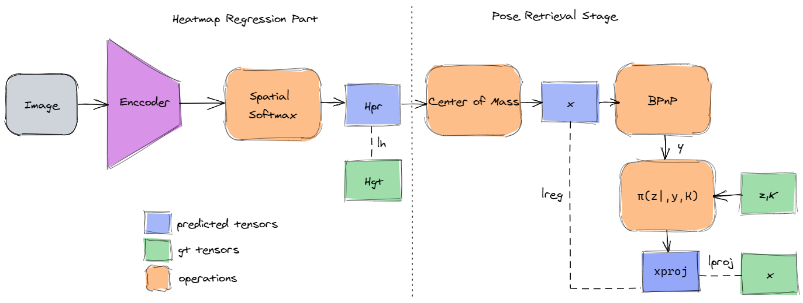

# EndToEndObjectPose
| [OpenReview]( https://openreview.net/forum?id=PCpGvUrwfQB) |
This repository contrains our code for replicating the following papers:
- End-to-End Learnable Geometric Vision by Backpropagating PnP Optimization [paper](https://arxiv.org/abs/1909.06043)
- HigherHRNet: Scale-Aware Representation Learning for Bottom-Up Human Pose Estimation [paper](https://arxiv.org/abs/1908.10357)

<span class="img_container center" style="display: block;">
    <p align="center">
    
    <br />
    <span class="img_caption" style="display: block; text-align: center;">Overview of the approach</span>
    </p>
</span>


## Setup
Our implementation is based on [moai](https://github.com/ai-in-motion/moai).
Please follow the intructions for installing the package.

## Data
The used dataset for running the experiments is [UAVA](https://vcl3d.github.io/UAVA/).
Please follow the instructions for downloading the data.

## Configuration files
We provide the configuration files for training the models reported in the paper. All the configuration files for conducting the reported experiments are split in unique folders containing all the necessary parts. More specifically each folder contains:
- **coordinate_regression**: Which is the main configuration file consisting of the definition of the different components.
- **data**: configuration file for defining the data loaders.
- **model**: configuration file for defining the model and differenet components.
- **losses**: configuration file for defining the losses.
- **metrics**: configuration file for defining the evaluation metrics.
- **options**: configuration file to define the visualization
functions, logging parameters, etc.

## Training
To start a training, run 
```commandline
moai train --coordinate_regression.yaml <main config file> --config-dir . <path_to_configuration_files>
root=<data_path>
obj_file=<drone_obj_file>
metadata=<metadata_path>
```


